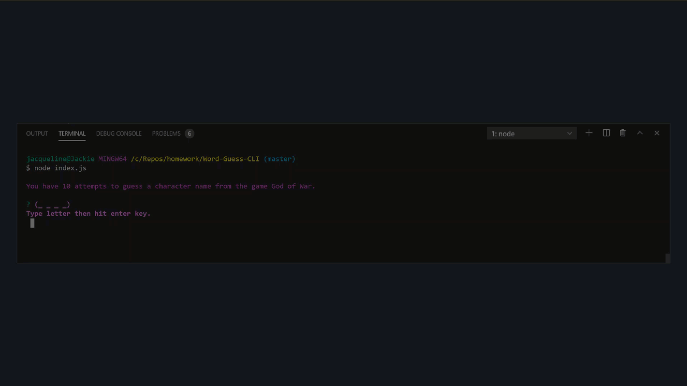

# Word-Guess-CLI
This app is a hangman-style word game that uses Node and Inquirer package as a command-line game using constructor functions. The index.js file will be the main source to run the game and has a dependency on the word.js file for the array of words. As for the word.js file it will depend on the letter.js files that store the letters guessed. I allowed the user to have 10 guesses of letters to put together a characters in the Playstation game, God of War. 

You start the game by running node index.js in the terminal. Once that is done then the game will load and say "You have 10 attempts to guess a character name from the game God of War.". You enter the letter one at a time. Below is a gif of the node app:

# Description of files -- From UCF Bootcamp Instructions 

* **Letter.js**: Contains a constructor, Letter. This constructor should be able to either display an underlying character or a blank placeholder (such as an underscore), depending on whether or not the user has guessed the letter. That means the constructor should define:

  * A string value to store the underlying character for the letter

  * A boolean value that stores whether that letter has been guessed yet

  * A function that returns the underlying character if the letter has been guessed, or a placeholder (like an underscore) if the letter has not been guessed

  * A function that takes a character as an argument and checks it against the underlying character, updating the stored boolean value to true if it was guessed correctly

* **Word.js**: Contains a constructor, Word that depends on the Letter constructor. This is used to create an object representing the current word the user is attempting to guess. That means the constructor should define:

  * An array of `new` Letter objects representing the letters of the underlying word

  * A function that returns a string representing the word. This should call the function on each letter object (the first function defined in `Letter.js`) that displays the character or an underscore and concatenate those together.

  * A function that takes a character as an argument and calls the guess function on each letter object (the second function defined in `Letter.js`)

* **index.js**: The file containing the logic for the course of the game, which depends on `Word.js` and:

  * Randomly selects a word and uses the `Word` constructor to store it

  * Prompts the user for each guess and keeps track of the user's remaining guesses

# Packages and Dependencies 
* Inquirer.js - https://www.npmjs.com/package/inquirer
* Node - https://www.npmjs.com/package/node
* Colors - https://www.npmjs.com/package/colors 

# Authors and Acknowledgement 
* For the character name source for the theme - https://en.wikipedia.org/wiki/Characters_of_God_of_War 
*  For an example of some code - https://www.npmjs.com/package/constructor-word-guess-2
* For an idea on how the code layout should look - https://gist.github.com/saltavenger/3939185  
https://www.codeproject.com/Articles/61917/Hangman-Game 
